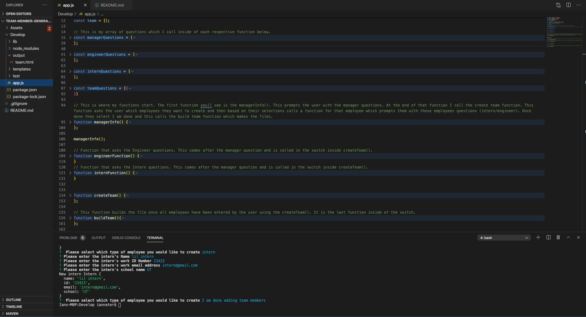

  # Employee Tracker App

  ## Description 
  This node app allows you to keep track of your employees easier. You can add departments, add roles, add employees, view all of those, and update employee records. 

  ## Table of Contents
  [Description](#description) 
  [Installation Instructions](#installation) 
  [Usage](#usage) 
  [Licenses](#license) 
  [Contributor Guidelines](#contributor-guidelines) 
  [Tests](#tests) 
  [Questions](#questions) 

  ## Installation
  npm i

  ## Usage
  1. In your terminal run npm I to install all needed dependencies
  2. Then run node server.js to start the app
  3. Use the arrow keys to toggle between desired choices. Once you have one you would like to select press enter
  4. Fill out the prompted questions
  5. See results by clicking on view employees
  

  ## License
  

  ## Contributor Guidelines
  This is closed to contribution 

  ## Tests 
  N/A

  ## Questions
   If you have any questions please contact me via email at ian.nater@gmail.com, you can also follow me on GitHub github.com/iannater

